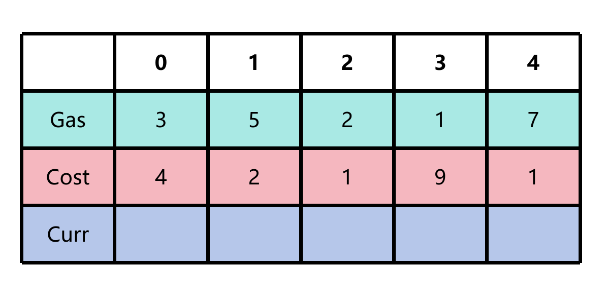
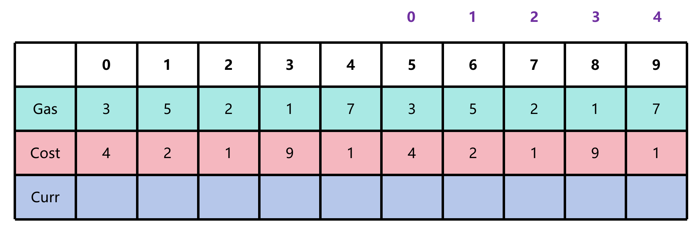
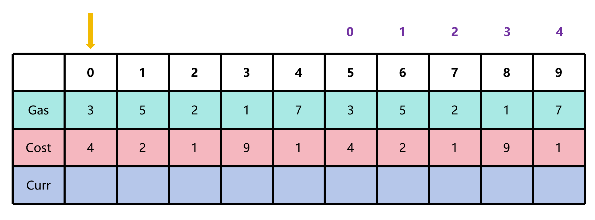
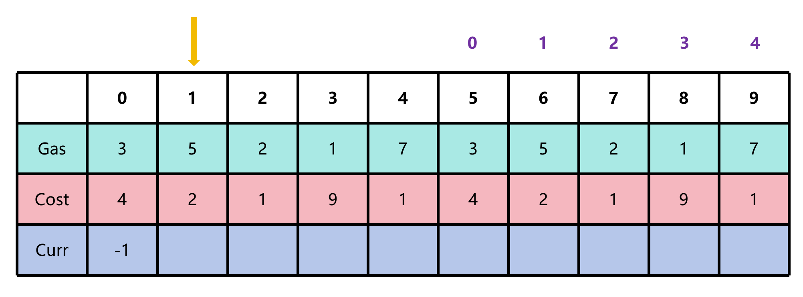
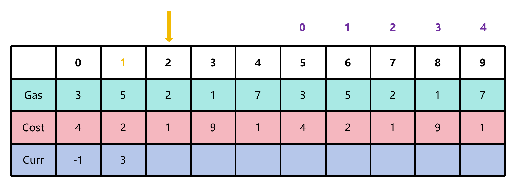
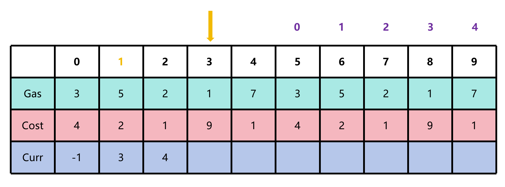
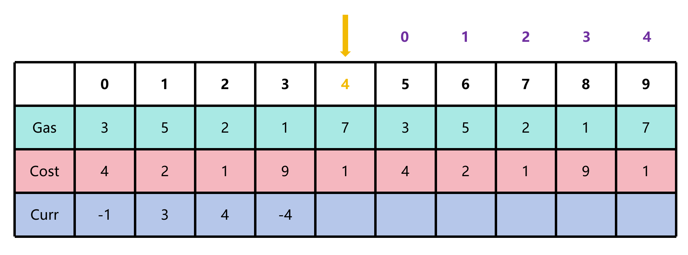
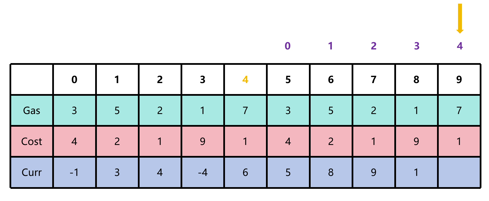

# 加油站问题

## 问题描述

有N个加油站，每个有A[i]升油，从i+1需要B[i]成本，找到能环绕一圈的加油站，否则返回-1

## 算法思路

假设给定 `A[i]: [3, 5, 2, 1, 7]`, `B[i]: [4, 2, 1, 9, 1]`



由于该题需要环绕，我们可以扩展一次来看

此时由于扩展了一次，所以如果起始位置为0, 那么终止位置应该是5



我们将指针指向0，让0成为候选



此时 `curr = curr + (A[0] - B[0]) = 0 + (3 - 4) = -1`，不满足条件，那么1成为候选，尝试指针指向1，然后重置 `curr` 为 0



此时 `curr = curr + (A[1] - B[1]) = 0 + (5 - 2) = 3`，满足条件，那么1保持候选，尝试指针指向2



此时 `curr = curr + (A[2] - B[2]) = 3 + (2 - 1) = 4`，满足条件，那么1保持候选，尝试指针指向3



此时 `curr = curr + (A[3] - B[3]) = 4 + (1 - 9) = -4`，不满足条件，那么4成为候选，尝试指针指向4，然后重置 `curr` 为 0



这里引伸出一个问题：**为什么2和3不能作为候选呢？**

- 由于 1 给了我们 -4 这个结果，那么如果 2 和 3 作为候选，那么一定会给出更差的结果，因此 2 和 3 不能作为候选

我们接着往下走，直到走到一个扩展最后



最终结果为 4

## 代码实现

这里我们可以考虑只遍历一次，我们可以计算**总剩余油量 (即不重置，算每个加油站的剩余油量的和)**，如果总的剩余油量大于等于0，则说明一定有解，否则无解

```c
int gasStation(int* A, int* B, int n)
{
    int total = 0; // 总剩余油量
    int curr = 0; // 当前段的净油量
    int candidate = 0; // 候选位置

    for (int i = 0; i < n; i++)
    {
        int diff = A[i] - B[i]; // 差值
        total += diff; // 总剩余油量增加
        curr += diff; // 当前段的净油量增加

        if (curr < 0)
        {
            candidate = i + 1; // 候选位置更新
            curr = 0; // 当前段的净油量重置
        }
    }

    return total >= 0 ? candidate : -1; // 如果总剩余油量大于等于0，则返回候选位置，否则返回-1
}