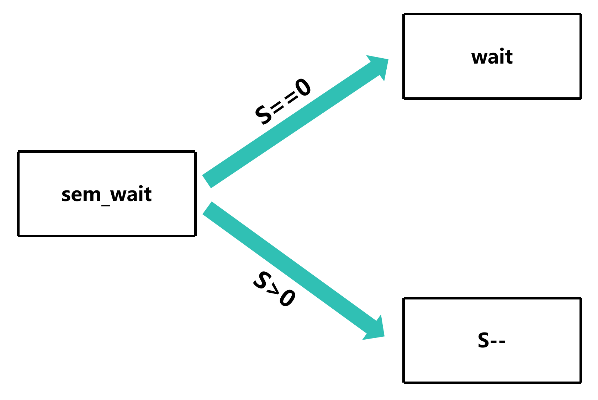
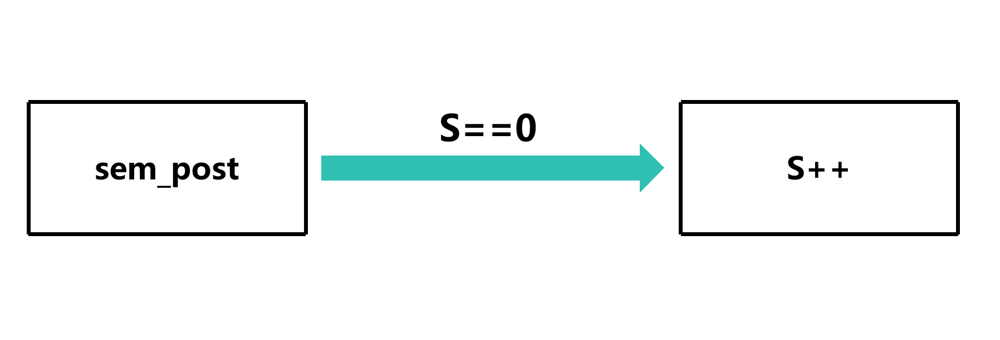
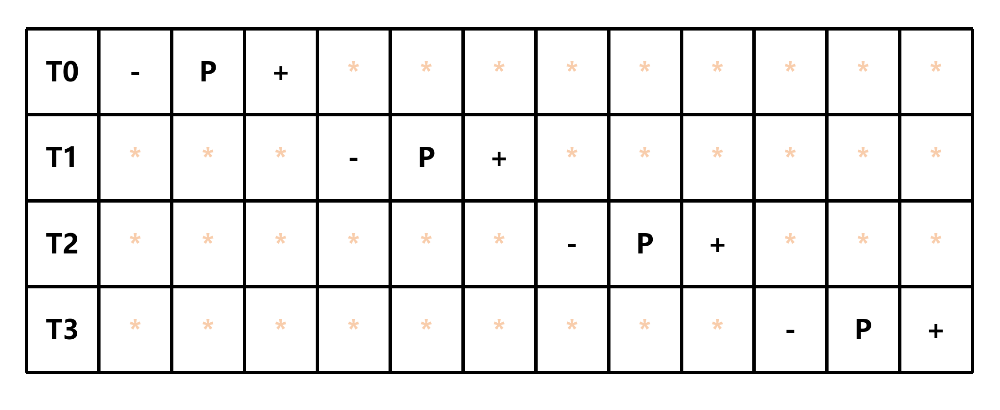

# 信号量简介 (Semaphores)

## 定义

信号量是一种用于控制对共享资源的访问的同步原语。它可以用于限制同时访问共享资源的线程数量，从而避免竞争条件和死锁

## 用法

### 引入 `semaphore.h`

```c
#include <semaphore.h>
```

### 声明信号量

```c
sem_t semaphore;
```

### 初始化信号量

```c
sem_init(&semaphore, 0, 1);
```

**注意：**

- **第二个参数有两种选择**
    - 0：用于线程
    - 1：用于进程

- **第三个参数表示信号量的初始值**
    - 例如，设置成 2 可以让两个线程同时访问共享资源和执行代码块

### 使用信号量

```c
sem_wait(&semaphore);
// 代码块
sem_post(&semaphore);
```

#### 示意图


##### sem_wait



##### sem_post



##### 运行过程



- S: 信号量的值

### 销毁信号量

```c
sem_destroy(&semaphore);
```

## 示例

[源代码](信号量简介.c)

## 与 Mutex 的区别

- 信号量用于**限制多个线程同时访问多个共享资源**和执行代码块，而 Mutex 只能控制一个线程并且用于**保护一个共享资源**和执行代码块
- 信号量可以用于线程和进程，而 Mutex 只能用于线程