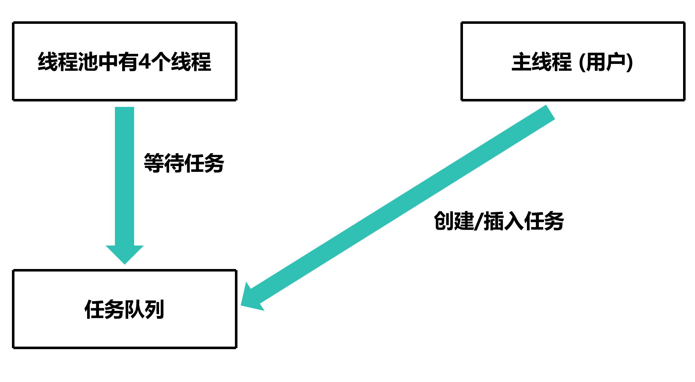

# 线程池

## 定义

- 线程池是一种基于池化思想管理线程的工具，经常出现在多线程服务器中，如MySQL
- 线程池的概念源于操作系统，是操作系统提供的一种服务
- 线程池维护着多个线程，等待着监督管理者分配可并发执行的任务
- 这些线程通过反复接收任务来执行，省去了线程创建的开销

## 图解

### 准备工作

#### 假设线程池里有4个线程


#### 任务队列


#### 一个主线程

这里的主线程就是线程池的管理者 (用户)


### 执行过程

#### 向任务队列中添加任务


#### 线程池中的线程等待管理者分配任务



#### 线程池中的线程执行任务


## 代码实现

**这里以两数相加为例**

### 设计任务

```c
// 任务
typedef struct Task
{
    int a ,b; // 用于两数相加
} Task;

// 任务队列
Task taskQueue[1024]; 
int taskCount = 0; // 任务数量

// 执行任务的函数
void executeTask(Task *task)
{
    int result = task->a + task->b;
    printf("%d + %d = %d\n", task->a, task->b, result);
}
```

### 创建一个任务

```c
int main(int argc, const char *argv[]) {
    Task t1 = {1,2};
    executeTask(&t1);
}
```

虽说是简单的两数相加，但是并没有体现出线程池的优势

### 创建线程池

```c
#define THREAD_NUM 4

int main(int argc, const char *argv[]) {
    pthread_t thread[THREAD_NUM];
    for (int i = 0; i < THREAD_NUM; i++)
    {
        if (pthread_create(&thread[i], NULL, &startThread, NULL) != 0)
        {
            perror("pthread_create");
        }
    }

    for (int i = 0; i < THREAD_NUM; i++)
    {
        if (pthread_join(thread[i], NULL)!= 0)
        {
            perror("pthread_join");
        }
    }
}
```

其中，`startThread` 函数用于等待和执行任务

```c
void *startThread(void *arg)
{
    while (1)
    {
        Task task;

        if (taskCount > 0)
        {
            task = taskQueue[0]; // 获取任务
            for (int i = 0; i < taskCount - 1; i++) // 任务队列前移一位
            {
                taskQueue[i] = taskQueue[i + 1];
            }
            taskCount--;
        }
    }
}
```

但是这样会在获取任务时发生竞态条件，所以需要加锁

```c
pthread_mutex_t mutex;

void *startThread(void *arg)
{
    while (1)
    {
        Task task;
        bool found = false; // 是否找到任务的标志位

        pthread_mutex_lock(&mutex);
        if (taskCount > 0)
        {
            found = true;
            task = taskQueue[0]; // 获取任务
            for (int i = 0; i < taskCount - 1; i++) // 任务队列前移一位
            {
                taskQueue[i] = taskQueue[i + 1];
            }
            taskCount--;
        }
        pthread_mutex_unlock(&mutex);

        if (found)
        {
            executeTask(&task); // 要在锁外执行任务，否则只是一个线程在执行任务
        }
    }
}
```

```c
pthread_mutex_t mutex;

int main(int argc, const char *argv[]) {
    pthread_t thread[THREAD_NUM];
    pthread_mutex_init(&mutex, NULL);
    for (int i = 0; i < THREAD_NUM; i++)
    {
        if (pthread_create(&thread[i], NULL, &startThread, NULL) != 0)
        {
            perror("pthread_create");
        }
    }

    for (int i = 0; i < THREAD_NUM; i++)
    {
        if (pthread_join(thread[i], NULL)!= 0)
        {
            perror("pthread_join");
        }
    }
    pthread_mutex_destroy(&mutex);
}
```

在执行完任务后，需要提交任务

### 提交任务

```c
void submitTask(Task task)
{
    pthread_mutex_lock(&mutex);
    taskQueue[taskCount] = task;
    taskCount++;
    pthread_mutex_unlock(&mutex);
}
```

### 测试

```c
// main

srand(time(NULL));
for (int i = 0; i < 100; i++)
{
    Task task = {rand() % 100, rand() % 100};
    submitTask(task);
}
```

```bash
gcc -o threadpool threadpool.c -pthread
./threadpool
...
98 + 6 = 104
2 + 43 = 45
65 + 37 = 102
97 + 95 = 192
79 + 60 = 139
42 + 38 = 80
36 + 58 = 94
32 + 26 = 58
50 + 72 = 122
91 + 65 = 156
89 + 33 = 122
64 + 76 = 140
35 + 14 = 49
```

可以看到，线程池成功执行了任务

但是，如果打开 `htop`，会发现 CPU 使用率非常高


这是因为线程池中的线程**并没有等待任务**，而是一直死循环，导致 CPU 使用率非常高

### 解决方案——条件变量

由于使用条件变量已经判断了任务是否存在，所以无需判断 `taskCount` 是否大于 0， `found` 变量也可以去掉

```c
pthread_mutex_t mutex;
pthread_cond_t cond;

void *startThread(void *arg)
{
    while (1)
    {
        Task task;

        pthread_mutex_lock(&mutex);
        while (taskCount == 0)
        {
            pthread_cond_wait(&cond, &mutex); // 等待任务
        }

        task = taskQueue[0]; // 获取任务
        for (int i = 0; i < taskCount - 1; i++) // 任务队列前移一位
        {
            taskQueue[i] = taskQueue[i + 1];
        }
        taskCount--;

        pthread_mutex_unlock(&mutex);

        executeTask(&task); // 要在锁外执行任务，否则只是一个线程在执行任务

    }
}
```

在 `submitTask` 函数中，需要通知线程池中的线程有任务了

```c
void submitTask(Task task)
{
    pthread_mutex_lock(&mutex);
    taskQueue[taskCount] = task;
    taskCount++;
    pthread_mutex_unlock(&mutex);
    pthread_cond_signal(&cond); // 通知线程池中的线程有任务了
}
```

[源代码](线程池.c)

### 测试
```bash
gcc -o threadpool threadpool.c -pthread
./threadpool
...
98 + 6 = 104
2 + 43 = 45
65 + 37 = 102
97 + 95 = 192
79 + 60 = 139
```

这时，再次打开 `htop`，会发现 CPU 使用率非常低


## 总结
- 线程池是一种基于池化思想管理线程的工具
- 线程池维护着多个线程，等待着监督管理者分配可并发执行的任务
- 这些线程通过反复接收任务来执行，省去了线程创建的开销

|     | 线程池 |
| :--:| :--: |
| 优点 | 1. 减少了线程创建和销毁的开销<br>2. 提高了响应速度<br>3. 提高了线程的可管理性 |
| 缺点 | 1. 线程池的大小需要根据实际情况进行调整<br>2. 线程池的任务队列需要根据实际情况进行调整 |
