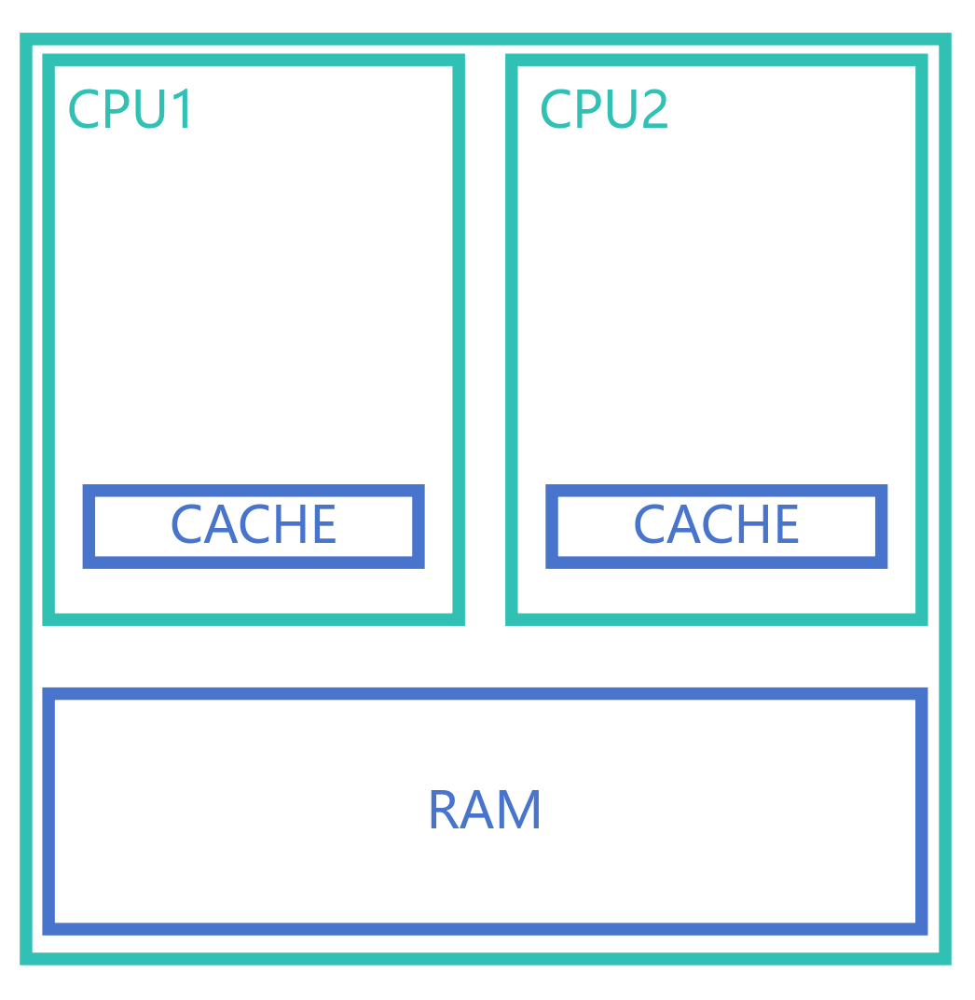
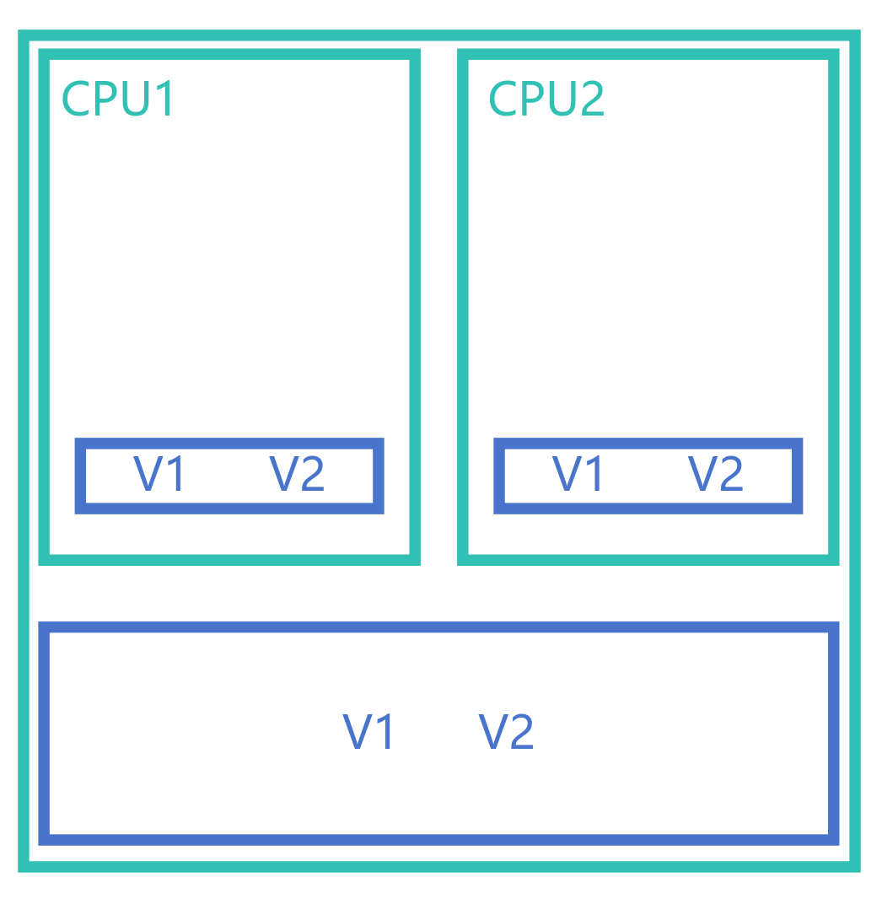
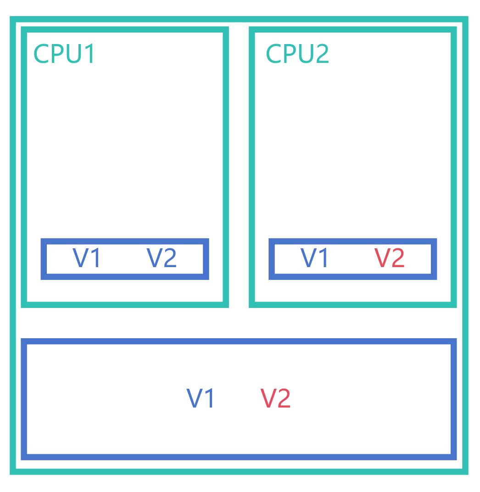
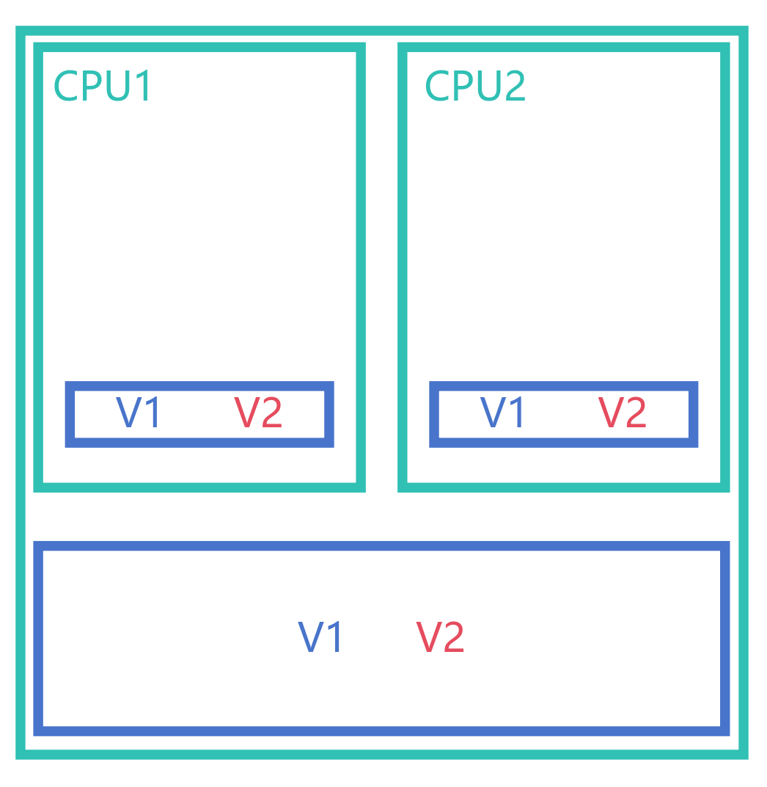
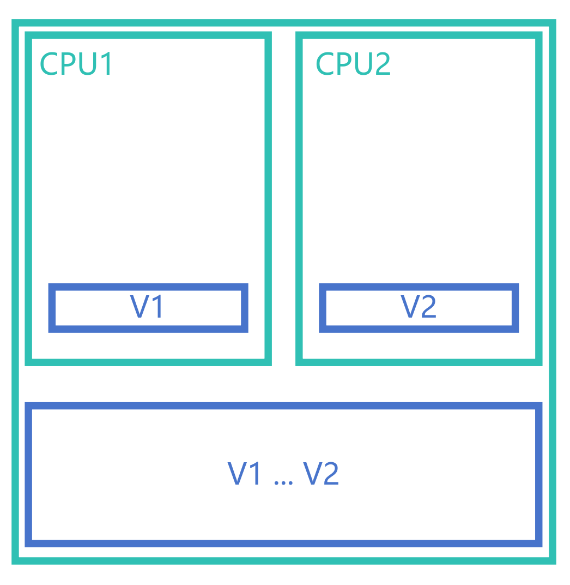

# 伪共享 (False Sharing)

**伪共享 (False Sharing)** 是多线程编程中的一种性能问题，它是由于缓存行的大小限制导致的。当多个线程共享同一块内存时，如果这些线程同时修改同一缓存行中的数据，就会导致缓存行中的其他数据也被同时修改，从而导致缓存行的其他数据被“伪共享”，进而影响缓存命中率，降低性能

## 示例代码

```c
#include <stdio.h>
#include <stdlib.h>
#include <stdint.h>
#include <pthread.h>

void *increment(void *arg)
{
    uint64_t *counter = (uint64_t *)arg;
    for (int i = 0; i < 1000000000; i++) // 10亿次操作
    {
        (*counter)++;
    }

    return NULL;
}

int main(void) {

    uint64_t counter1 = 0;
    uint64_t counter2 = 0;

    pthread_t t1, t2;
    pthread_create(&t1, NULL, increment, &counter1);
    pthread_create(&t2, NULL, increment, &counter2);

    pthread_join(t1, NULL);
    pthread_join(t2, NULL);

    printf("counter1 = %lu\n", counter1);
    printf("counter2 = %lu\n", counter2);

    return 0;
}
```

### 运行

这里使用 `time` 命令来统计程序运行时间

```bash
time ./false_sharing 
counter1 = 1000000000
counter2 = 1000000000
./false_sharing  5.39s user 0.00s system 196% cpu 2.740 total
```

可以看到，程序运行速度受到了影响

## 解决该问题

这里可以在这两个变量之间添加一个 `dummy` 数组

```c
uint64_t counter1 = 0;
char dummy[128] = {0}; // 128字节的 dummy 数组
uint64_t counter2 = 0;
```

再次运行程序

```bash
time ./false_sharing 
counter1 = 1000000000
counter2 = 1000000000
./false_sharing  4.23s user 0.00s system 196% cpu 2.020 total
```

可以看到，程序运行速度得到了提升

## 原因

由于现代 CPU 为了减少内存访问延迟，都会内置缓存机制，而每个缓存里面会存储一个连续的内存块 (称为缓存行)，一个缓存行的大小一般为 64 字节到 256 字节不等



假设现在该程序在一个双核 CPU 执行

由于 `counter1` 和 `counter2` 都在同一个缓存行中，因此两个 CPU 核心都有这两个变量的副本



当其中一个线程修改某个变量时



由于 CPU 的缓存行存在一致性协议 (如 [MESI](https://en.wikipedia.org/wiki/MESI_protocol))，因此一个核修改缓存行，其他核的同缓存行强制失效，必须重刷内存才能看到修改后的结果



这会影响缓存命中率，降低性能

为了解决这个问题，需要确保两个变量不在同一个缓存行中，即使它们共享同一块内存

## 解决方案

可以通过 `sysconf(_SC_LEVEL1_DCACHE_LINESIZE)` 函数获取缓存行的大小 (仅适用于 POSIX 系统)

然后使用 `alignas` 关键字来对齐变量，使得它们不会共享同一缓存行 (C11 标准引入)

```c
#include <unistd.h> // `sysconf` 函数所在头文件

long cache_line_size = sysconf(_SC_LEVEL1_DCACHE_LINESIZE); // 获取缓存行大小
printf("cache line size = %ld\n", cache_line_size); // 输出缓存行大小 (这里假设缓存行大小为 64 字节)

uint64_t alignas(64) counter1 = 0; // 对齐 counter1 变量
uint64_t alignas(64) counter2 = 0; // 对齐 counter2 变量
```

再次运行程序

```bash
time ./solution
cache line size = 64
counter1 = 1000000000
counter2 = 1000000000
./solution  1.10s user 0.00s system 178% cpu 0.619 total
```

可以看到，程序运行速度得到了提升，因为两个变量已经不再共享同一缓存行了

