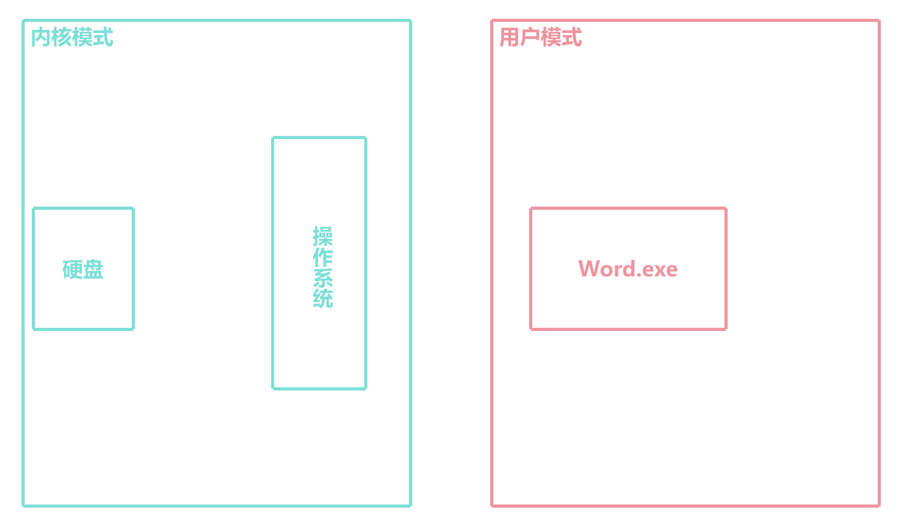
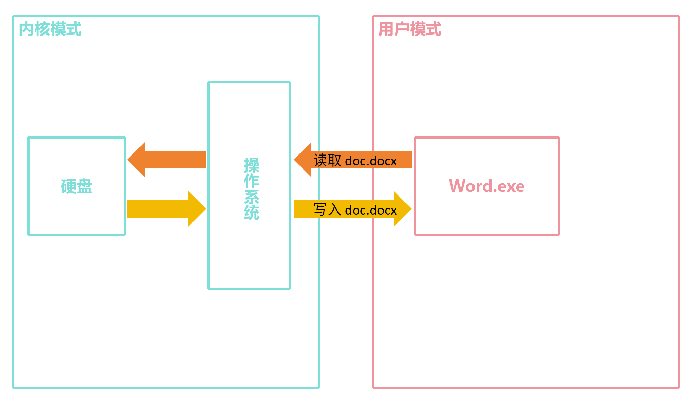
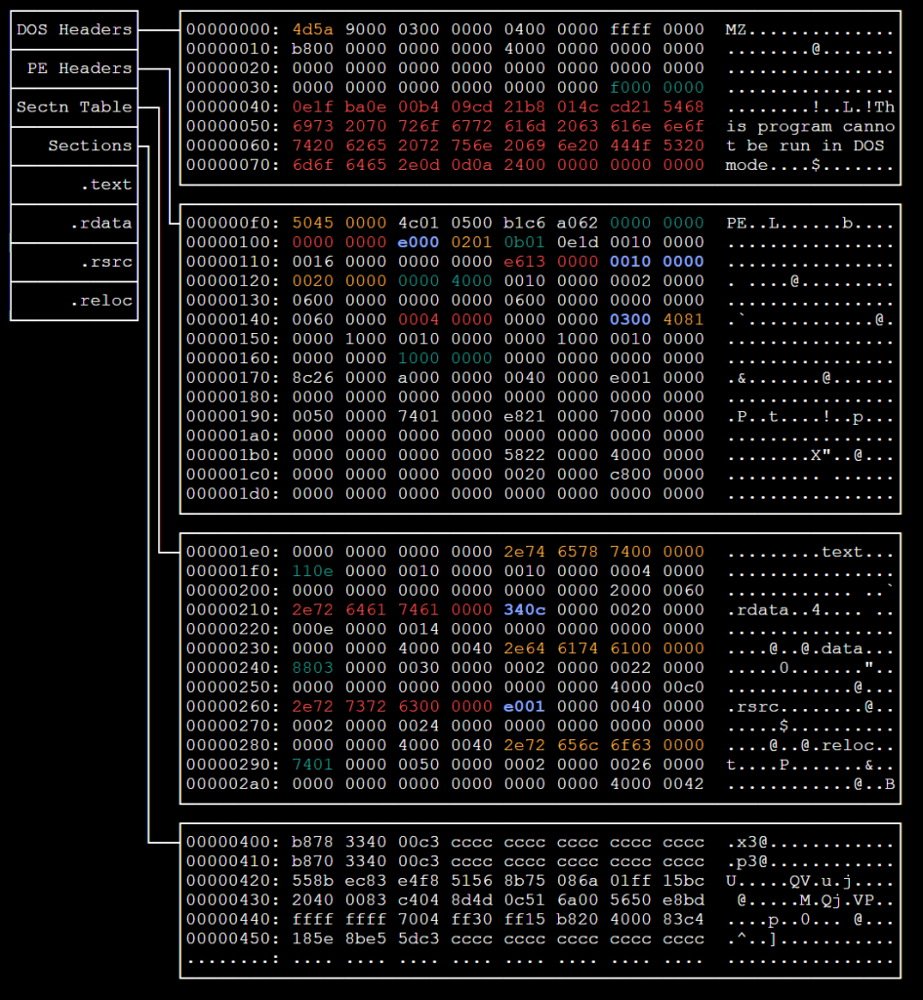

# 为什么使用程序是特定于操作系统？

## 首先我们先想象这样一个场景

你将一个 Windows 上的程序 (.exe) 拷贝到 Mac 上，然后双击运行，会发现程序无法运行

## 原因1——系统调用 (System Calls)

### 首先看一下通用操作系统

**通用操作系统一般可以运行多个程序并共享硬件资源**

但这样会导致**安全问题**，因为**任何程序可以利用 CPU 漏洞去控制操作系统**

### 解决方案——隔离用户空间和内核空间

为了避免这个问题，CPU 会运行两种模式：<mark>**用户模式 (User Mode) **和**内核模式 (Kernel Mode)**</mark>



内核模式：也被称为**特权模式 (Privileged Mode)**，可以运行 CPU 中的任何指令，从而完全控制计算机，例如在用户模式下操作 I/O 设备和硬件组件和内存

用户模式：也被称为**非特权模式 (Unprivileged Mode)**，只能运行有限的任务，例如移动数据、复制数据、运算、浮点数操作、位移操作、评估、循环等

**这样可以确保用户程序获得未授权的访问**

但是这样也带来了一个问题，例如用户程序需要使用网卡发送数据，但是用户模式下无法直接操作网卡

### 解决方法——系统调用

#### 图解

例如 Word 程序要读取磁盘上的文件



系统调用一般由操作系统提供接口，用户程序通过系统调用来请求操作系统提供的服务，一般由 C 语言函数提供

#### 以下是一些常见的系统调用

| 系统调用 | Windows | Linux |
| :------- | :-----: | :---: |
| 进程管理 | CreateProcess() <br /> ExitProcess() <br /> WaitForSingleObject() | fork() <br /> exit() <br /> wait() |
| 文件操作 | CreateFile() <br /> ReadFile() <br /> WriteFile() <br /> CloseHandle() | open() <br /> read() <br /> write() <br /> close() |
| 设备操作 | SetConsoleMode() <br /> ReadConsole() <br /> WriteConsole() | ioctl() <br /> read() <br /> write() |

**这里可以看到，Windows 和 Linux 系统调用的接口是不同的**，从这里开始就出现了**跨平台问题**，通常情况下，大多数应用程序都依赖于操作系统提供的系统调用接口

#### 查看某个程序的系统调用 (Linux)

```bash
cat /proc/30281/status

...
voluntary_ctxt_switches:	46
...
```

你可以看到 `voluntary_ctxt_switches` 这一行，这就是程序的上下文切换次数，也就是使用系统调用的次数

### 系统调用的运行方式的不同

### 例如 CreateProcess() 与 fork() 函数

在 Windows 中，CreateProcess() 函数会创建一个新的进程，然后将控制权交给新的进程

在 Linux 中，fork() 函数会克隆当前进程，两个进程会共享代码和数据，但是会有不同的 PID

### 不同平台编译程序会有不同的结果

在不同平台编译同一份代码，会得到不同的结果

以下反汇编后的结果

Windows 平台:

```asm
_start:
    mov r10, rcx
    mov eax, 0x3b
    mov rdx, pi_struct
    mov r8, si_struct
    syscall

    test eax, eax
    jnz error
```

Linux 平台:

```asm
_start:
    mov rax, 57
    syscall
    test rax, rax
    js fork_error
    jz child_process

parent_process:
    mov rax, 60
    xor rdi, rdi
    syscall

child_process:
    mov rax, 59
    mov rdi, programPath
    mov rsi, argv
    mov rdx, envp
    syscall
```

其中，`syscall` 用于触发中断，使 CPU 切换到内核模式

而 `mov rax, 57` 、`mov rax, 60` 、```mov rax, 59` 则表示不同的系统调用

这里是 Linux 内核中的系统调用表：[传送门](https://github.com/torvalds/linux/blob/master/arch/x86/entry/syscalls/syscall_64.tbl)

在不同平台上，系统调用表是不同的，例如 57 在 Linux 上是 `sys_fork`, 在 Windows 上是 `NtFsControlFile`

### 对参数的存储方式也不同

以下面的代码为例

```c
int chmod(const char *pathname, mode_t mode);
```

一种是使用寄存器

```asm
mov rax, 90
mov rdi, pathname
mov rsi, mode   
syscall
```

另一种是使用栈

```asm
sub rsp, 16
mov qword [rsp], pathname
mov qword [rsp+8], mode
mov rax, 90
mov rdi, rsp
syscall
add rsp, 16
```

在 Linux 中，如果参数小于等于 6 个，必须使用寄存器，大于 6 个会将剩下的参数压入栈中

## 原因2——可执行文件格式

所有可执行文件不止有指令，还有数据让操作系统加载运行，这样需要规定可执行文件的格式

Windows 可执行文件格式：PE (Portable Executable)


Linux 可执行文件格式：ELF (Executable and Linkable Format)
