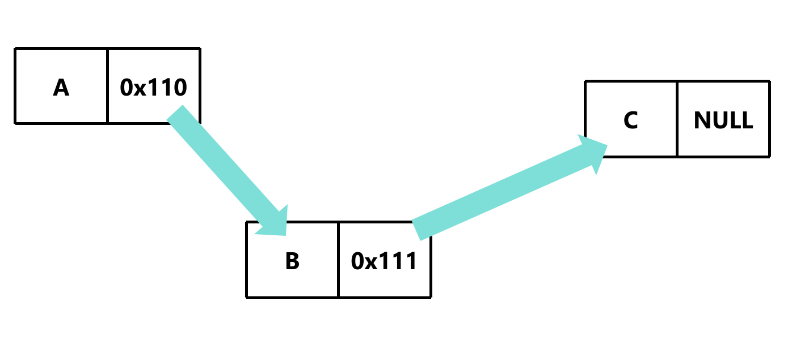

# 单链表简介

## 定义
单链表是一种链式存取的数据结构，用一组地址任意的存储单元存放线性表中的数据元素

## 特点
1. 表中元素的逻辑顺序是通过链表中的指针链接次序实现的
2. 链表由一系列节点（链表中每一个元素称为节点）组成，节点可以在运行时动态生成

## 图示


## 代码示例

### 定义节点格式

```c
typedef struct Node { // 定义节点
    int data; // 数据域
    struct Node *next; // 指针域
} Node;
```

#### `struct Node *next` 为什么不能是 `Node *next` ？

`typedef` 是把 `struct Node` 重命名为 `Node`，但是结构体里面还没有定义 `Node`，所以不能使用 `Node` 来定义 `next`

### 创建节点

```c
int main(int argc, const char * argv[]) {

    Node *root; // 头节点
    Node *node1; // 节点1

    return 0;
}
```

### 连接节点

```c
int main(int argc, const char * argv[]) {

    Node root; // 头节点
    Node node1; // 节点1

    root.data = 1; 
    root.next = node1;

    node1.data = 2;
    node1.next = NULL;

    return 0;
}
```

#### 这里出现的问题

如果节点数量很多，那么代码会非常繁琐

#### 解决方案——`malloc` 函数

```c
int main(int argc, const char * argv[]) {

    Node root; // 头节点

    root.data = 1; 
    root.next = malloc(sizeof(Node));

    root.next->data = 2;
    root.next->next = NULL;

    return 0;
}
```

### 释放内存

```c
int main(int argc, const char * argv[]) {

    Node root; // 头节点

    root.data = 1; 
    root.next = malloc(sizeof(Node));

    root.next->data = 2;
    root.next->next = NULL;

    free(root.next);

    return 0;
}
```

[源代码](单链表简介.c)
