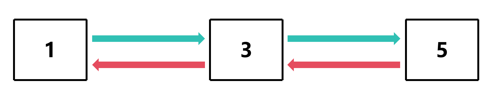
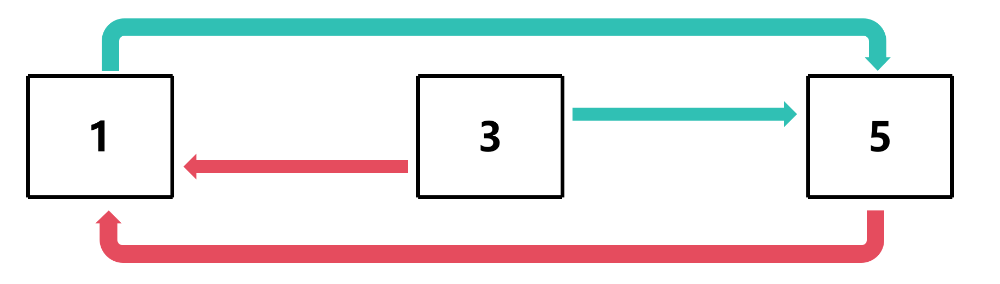
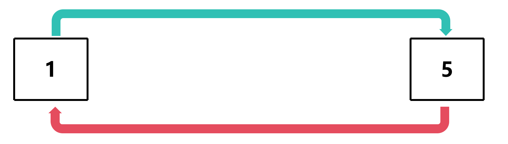

# 删除元素 (双链表)

## 步骤

1. 找到需要删除的节点
2. 让需要删除的节点的前一个节点的`next`指向需要删除的节点的`next`
3. 让需要删除的节点的后一个节点的`prev`指向需要删除的节点的`prev`
4. 让需要删除的节点的`prev`和`next`指向NULL

## 图解

例如移除第二个节点





## 代码示例

## 简单方法

### 更改节点指针的指向

```c
void remove_element(Node *node)
{
    node->prev->next = node->next;
    node->next->prev = node->prev;
}
```

#### 这里出现的问题

1. 如果`node`是头节点，`node->prev`就是`NULL`，会导致段错误
2. 如果`node`是尾节点，`node->next`就是`NULL`，会导致段错误

#### 解决方案——添加检测

```diff
void remove_element(Node *node)
{
-    node->prev->next = node->next;
-    node->next->prev = node->prev;
+    if (node->prev != NULL)
+    {
+        node->prev->next = node->next;
+    }
+    if (node->next != NULL)
+    {
+        node->next->prev = node->prev;
+    }
}
```

### 释放要删除的节点

```c
void remove_element(Node *node)
{
    if (node->prev != NULL)
    {
        node->prev->next = node->next;
    }
    if (node->next != NULL)
    {
        node->next->prev = node->prev;
    }
    
    free(node);
}
```

### 调用函数

例如移除第二个节点

```c
remove_element(tail->next);
```

#### 这里出现的问题

如果释放的是尾节点，在遍历链表的时候会出现问题

#### 解决方案——添加临时变量

```c
    Node *temp = tail->next;
    remove_element(tail); // 移除尾节点
    tail = temp; // 更新尾节点
```

[源代码](双链表删除元素.c#L11)

## 通用方法

### 为删除尾节点添加特殊处理

```c
void remove_element_tail(Node **tail, int value)
{
    if ((*tail)->x == value)
    {
        Node *need_remove = *tail;
        *tail = (*tail)->next;
        free(need_remove);
        return;
    }
}
```

### 从 tail->next 开始遍历

```c
void remove_element_tail(Node **tail, int value)
{
    if ((*tail)->x == value)
    {
        Node *need_remove = *tail;
        *tail = (*tail)->next;
        free(need_remove);
        return;
    }

    for (Node *curr = (*tail)->next; curr != NULL; curr = node->next) {   }
}
```

### 找到需要删除的节点并移除

```c
void remove_element_tail(Node **tail, int value)
{
    if ((*tail)->x == value)
    {
        Node *need_remove = *tail;
        *tail = (*tail)->next;
        free(need_remove);
        return;
    }

    for (Node *curr = (*tail)->next; curr != NULL; curr = curr->next)
    {
        if (curr->x == value)
        {
            Node *need_remove = curr;
            curr->prev->next = curr->next;
            if (curr->next != NULL)
            {
                curr->next->prev = curr->prev;
            }
            free(need_remove);
            return;
        }
    }    
}
```

[源代码](双链表删除元素通用方法.c#L11)

### 从头节点开始也是一样

```c
void remove_element_head(Node **head, int value)
{
    if ((*head)->x == value)
    {
        Node *need_remove = *head;
        *head = (*head)->next;
        free(need_remove);
        return;
    }
    for (Node *curr = (*head)->next; curr != NULL; curr = curr->next)
    {
        if (curr->x == value)
        {
            Node *need_remove = curr;
            if (curr->prev != NULL)
            {
                curr->prev->next = curr->next;
            }
            curr->next->prev = curr->prev;
            free(need_remove);
            return;
        }
    }
}
```