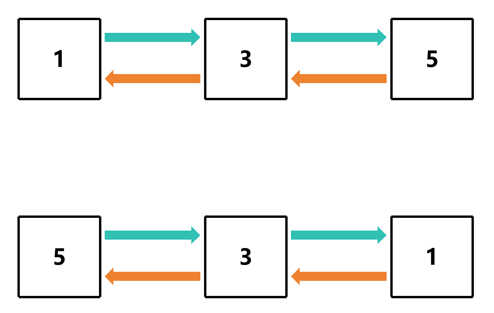

# 双链表反转

## 步骤

1. 遍历链表
2. 把当前节点的 `next` 指向 `prev`
3. 把 `prev` 指向当前节点
4. 把当前节点指向 `next`
5. 交换 `tail` 和 `head`

### 图解



## 代码示例

### 遍历链表

```c
void revserse(Node **tail, Node **head)
{
    Node *curr = *tail; // 从尾节点开始遍历

    while (curr != NULL) {   }
}
```

### 把当前节点的 `next` 指向 `prev`

```c
void revserse(Node **tail, Node **head)
{
    Node *curr = *tail; // 从尾节点开始遍历

    while (curr != NULL)
    {
        Node *next = curr->next; // 保存当前节点的下一个节点
        
        curr->next = curr->prev; // 把当前节点的 next 指向 prev
    }
}
```

### 把 `prev` 指向当前节点

```c
void revserse(Node **tail, Node **head)
{
    Node *curr = *tail; // 从尾节点开始遍历
    
    while (curr!= NULL)
    {
        Node *next = curr->next; // 保存当前节点的下一个节点

        curr->next = curr->prev; // 把当前节点的 next 指向 prev
        curr->prev = next; // 把 prev 指向当前节点
    }
}
```

### 把当前节点指向 `next`
```c
void revserse(Node **tail, Node **head)
{
    Node *curr = *tail; // 从尾节点开始遍历
    
    while (curr!= NULL)
    {
        Node *next = curr->next; // 保存当前节点的下一个节点

        curr->next = curr->prev; // 把当前节点的 next 指向 prev
        curr->prev = next; // 把 prev 指向当前节点

        curr = next; // 把当前节点指向 next
    }
}
```

### 交换 `tail` 和 `head`

```c
void revserse(Node **tail, Node **head)
{
    Node *curr = *tail; // 从尾节点开始遍历
    
    while (curr!= NULL)
    {
        Node *next = curr->next; // 保存当前节点的下一个节点

        curr->next = curr->prev; // 把当前节点的 next 指向 prev
        curr->prev = next; // 把 prev 指向当前节点

        curr = next; // 把当前节点指向 next
    }

    Node *temp = *tail; // 使用一个临时变量保存 tail
    *tail = *head; // 把 tail 指向 head
    *head = temp; // 把 head 指向 temp
}
```

[源代码](双链表反转.c#L11)