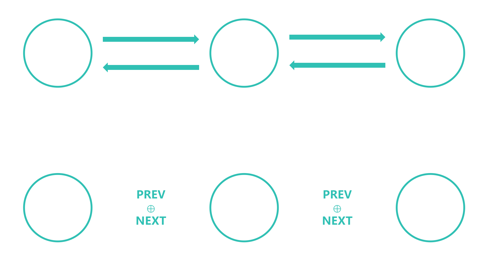

# 异或链表

异或链表 (XOR Linked List) 是一种双向链表数据结构，它是通过对每个节点的值进行异或运算来实现的

## 原理

两个不同的值 `a` 和 `b` 有这样一个公式——`a ^ b ^ b = a`，也就是说，`a ^ b` 与 `b` 异或之后的值等于 `a`，而 `b` 与 `b` 异或之后的值等于 `0`，因此，我们可以用 `xor_ptr` 指针来实现 `next` 和 `prev` 指针的功能

## 区别

使用传统的双向链表需要保存 `next` 和 `prev` 指针，而异或链表只需要保存 `value` 值，通过对 `value` 值进行异或运算来实现 `next` 和 `prev` 指针的功能



## 实现

### 节点设计

我们需要两个成员，一个是值，一个是指针 (用于异或运算)

```c
typedef struct Node {
    int value; // 值
    uintptr_t xor_ptr; // 用于异或运算的指针
} Node;
```

### 创建节点

```c
Node *create_node(int value)
{
    Node *node = malloc(sizeof(Node));
    memset(node, 0, sizeof(Node));
    node->value = value;
    node->xor_ptr = 0; // 0 表示没有前驱节点或后继节点

    return node;
}
```

- `xor_ptr` 初始化为 0 表示**没有前驱节点或后继节点**

### 链表设计

这里我们只保存头节点和尾节点的指针，通过 `xor_ptr` 指针来实现 `next` 和 `prev` 指针的功能

```c
typedef struct XORLinkedList {
    Node *head; // 头节点
    Node *tail; // 尾节点
} XORLinkedList;
```

### 向链表中添加节点

```c
void add_node(XORLinkedList *list, int value);
```

#### 1. 如果链表为空，保证 `head` 和 `tail` 都为 `NULL`

```c
void add_node(XORLinkedList *list, int value)
{
    if (list->head == NULL)
    {
        assert(list->tail == NULL); // 链表为空
    }
}
```

#### 2. 链表为空时，创建一个节点，并将 `head` 和 `tail` 都指向这个节点

```c
void add_node(XORLinkedList *list, int value)
{
    if (list->head == NULL)
    {
        assert(list->tail == NULL); // 链表为空

        Node *node = create_node(value);
        list->head = node;
        list->tail = node;
        return;
    }
}
```

#### 3. 链表不为空时，创建一个节点并添加到链表的尾部

```c
void add_node(XORLinkedList *list, int value)
{
    if (list->head == NULL) // 链表为空
    {
        assert(list->tail == NULL); // 确保链表为空

        Node *node = create_node(value);
        list->head = node;
        list->tail = node;
        return;
    }
    else // 链表不为空
    {
        Node *node = create_node(value);
        node->xor_ptr = (uintptr_t)list->tail; // 指向尾节点
        list->tail->xor_ptr ^= (uintptr_t)node; // 尾节点指向新节点
        list->tail = node; // 更新尾节点
    }
}
```

- `node->xor_ptr = (uintptr_t)list->tail;` 用于指向之前的尾节点
- `list->tail->xor_ptr ^= (uintptr_t)node;` 用于更新尾节点的 `xor_ptr` 指针，使其指向新节点
- `list->tail = node;` 用于更新尾节点的指针

### 遍历链表

#### 1. 提取下一个节点的指针

```c
Node *get_next_node(Node *node, uintptr_t *prev_xor_ptr)
{
    Node *next_node = (Node *)((uintptr_t)node->xor_ptr ^ *prev_xor_ptr);
    *prev_xor_ptr = (uintptr_t)node; // 更新 prev_xor_ptr

    return next_node;
}
```

- `next_node = (Node *)((uintptr_t)node->xor_ptr ^ *prev_xor_ptr);` 用于获取下一个节点的指针
- `*prev_xor_ptr = (uintptr_t)node;` 用于更新 `prev_xor_ptr` 指针，使其指向当前节点

#### 2. 遍历链表

```c
void traverse_list(XORLinkedList *list)
{
    Node *node = list->head;
    uintptr_t prev_xor_ptr = 0; // 初始 prev_xor_ptr 为 0

    for (Node *iter = list->head; iter != NULL; iter = get_next_node(iter, &prev_xor_ptr))
    {
        // 处理当前节点
        printf("%d ", iter->value);
    }
    printf("\n");
}
```

#### 3. 如果要倒序遍历，只需要将 `iter` 指针指向 `tail` 节点，然后遍历链表

```c
void traverse_list(XORLinkedList *list)
{
    Node *node = list->tail;
    uintptr_t prev_xor_ptr = 0; // 初始 prev_xor_ptr 为 0

    for (Node *iter = list->tail; iter != 0; iter = get_next_node(iter, &prev_xor_ptr)) // 倒序遍历
    {
        // 处理当前节点
        printf("%d ", iter->value);
    }
    printf("\n");
}
```