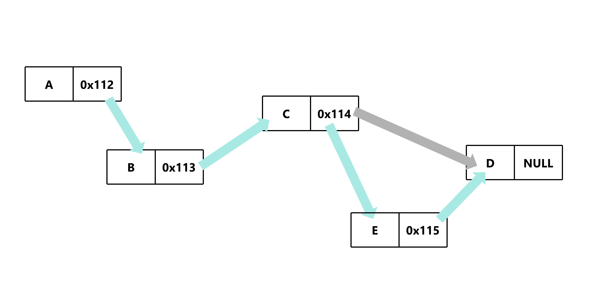

# 任意位置插入元素

## 步骤

1. 先创建一个新节点
2. 上一个节点的指针域存储新节点的地址
3. 新节点的指针域存储下一个节点的地址

## 示意图



## 代码示例

```c
void insert_after(Node *node, int value)
{
    Node *newNode = (Node *)malloc(sizeof(Node));
    if (newNode == NULL)
    {
        return;
    }

    newNode->x = value;
    newNode->next = node->next; // 新节点的指针域存储下一个节点的地址
    node->next = newNode; // 上一个节点的指针域存储新节点的地址
}
```

[源代码](任意位置插入元素.c#L9)

### 为什么不用二级指针？

由于此处不需要改变整个节点的地址，所以不需要用二级指针

