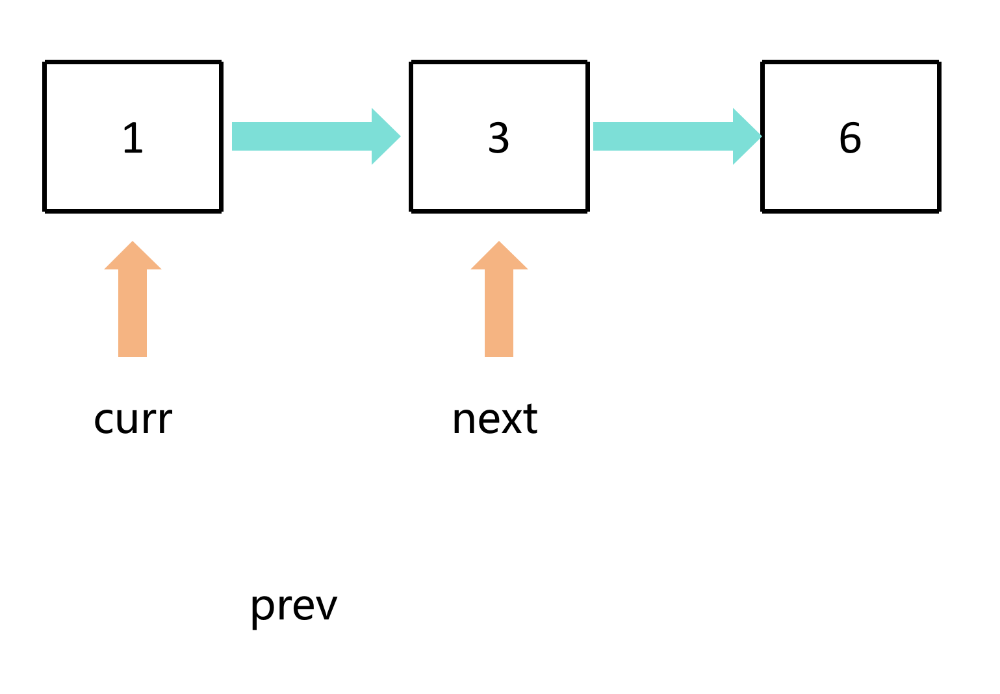
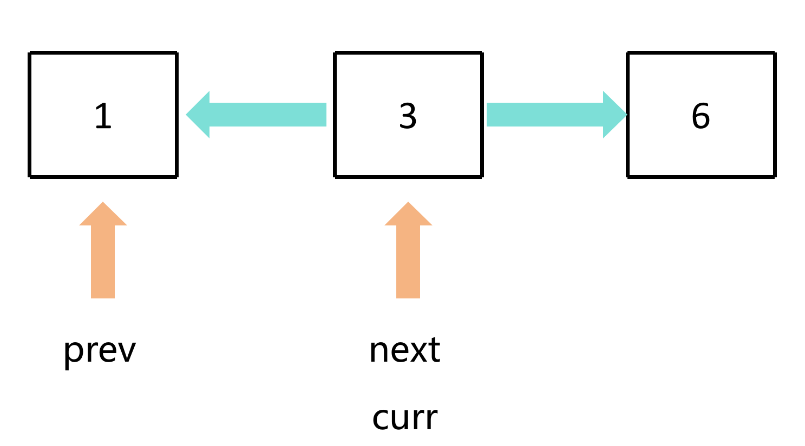
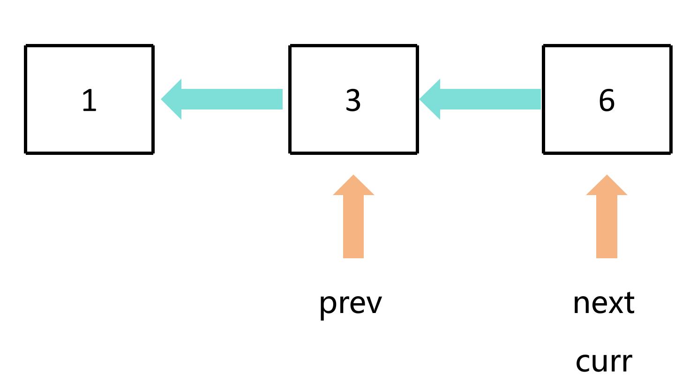

# 链表反转

## 步骤

1. 定义三个指针：`prev`、`curr`、`next`
2. 每次查看`curr`节点是否为`NULL`，如果是，则结束循环，获得结果
3. 如果不是，则先设置临时变量`next`为当前节点的下一个节点
4. 接下来就是当前节点指针指向前一个节点，`prev`指针移动到`curr`指针的位置
5. 最后`curr`指针移动到next指针的位置，重复上述过程

## 图解

### 初始状态


### 循环



### 结束


## 代码示例

### 定义三个指针

```c
void reverse(Node **root)
{
    Node *prev = NULL; // 前一个节点
    Node *curr = *root; // 当前节点

    while(curr != NULL)
    {
        Node *next = curr->next; // 下一个节点
    }
}
```

### 交换指针位置

```c
void reverse(Node **root)
{
    Node *prev = NULL; // 前一个节点
    Node *curr = *root; // 当前节点

    while(curr != NULL)
    {
        Node *next = curr->next; // 下一个节点

        curr->next = prev; // 反转当前节点的指针
        prev = curr; // 前一个节点移动到当前节点
    }
}
```

### 重新确定头节点
```c
void reverse(Node **root)
{
    Node *prev = NULL; // 前一个节点
    Node *curr = *root; // 当前节点

    while(curr != NULL)
    {
        Node *next = curr->next; // 下一个节点

        curr->next = prev; // 反转当前节点的指针
        prev = curr; // 前一个节点移动到当前节点
        curr = next; // 当前节点移动到下一个节点
    }

    *root = prev; // 更新根节点
}
```

[源代码](链表反转.c#L9)