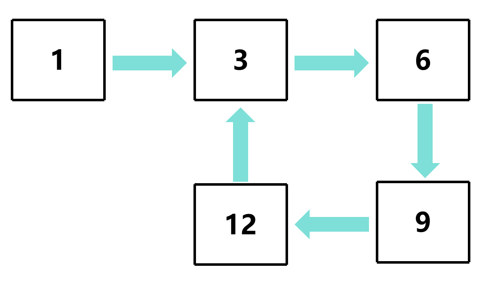
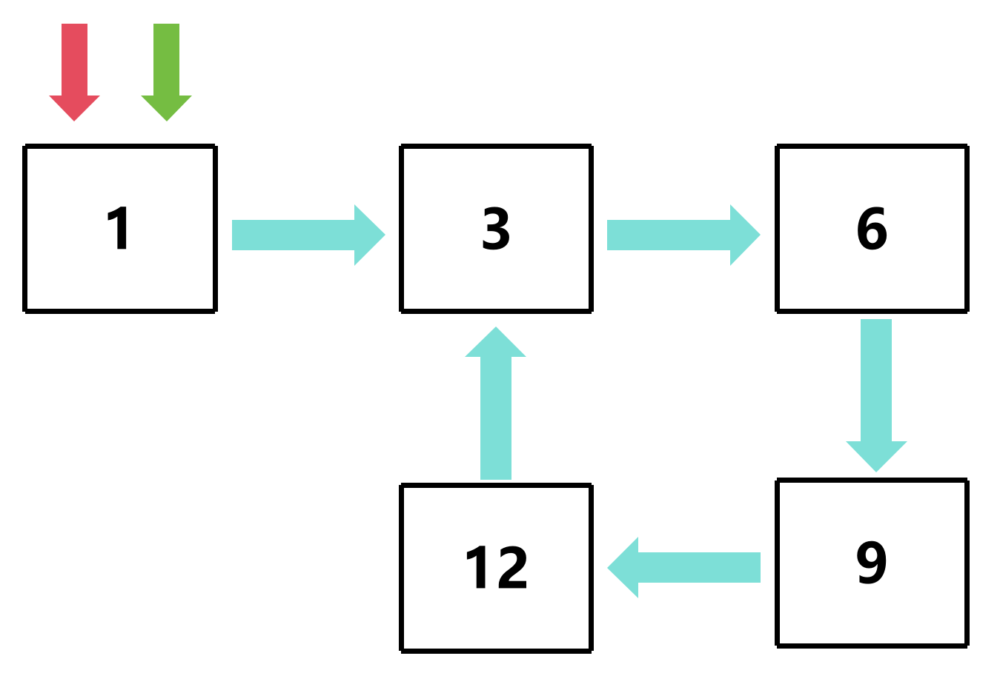
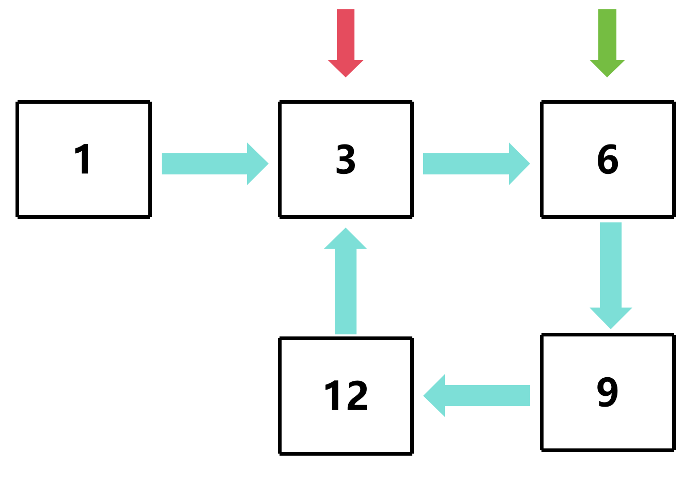
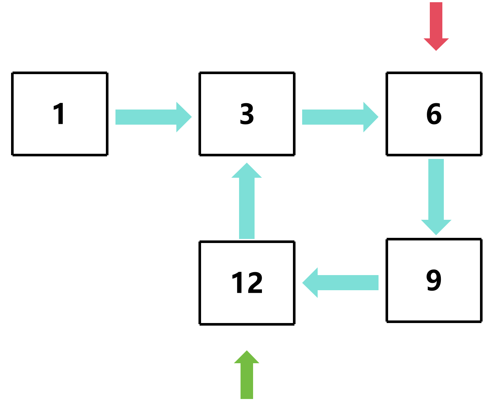
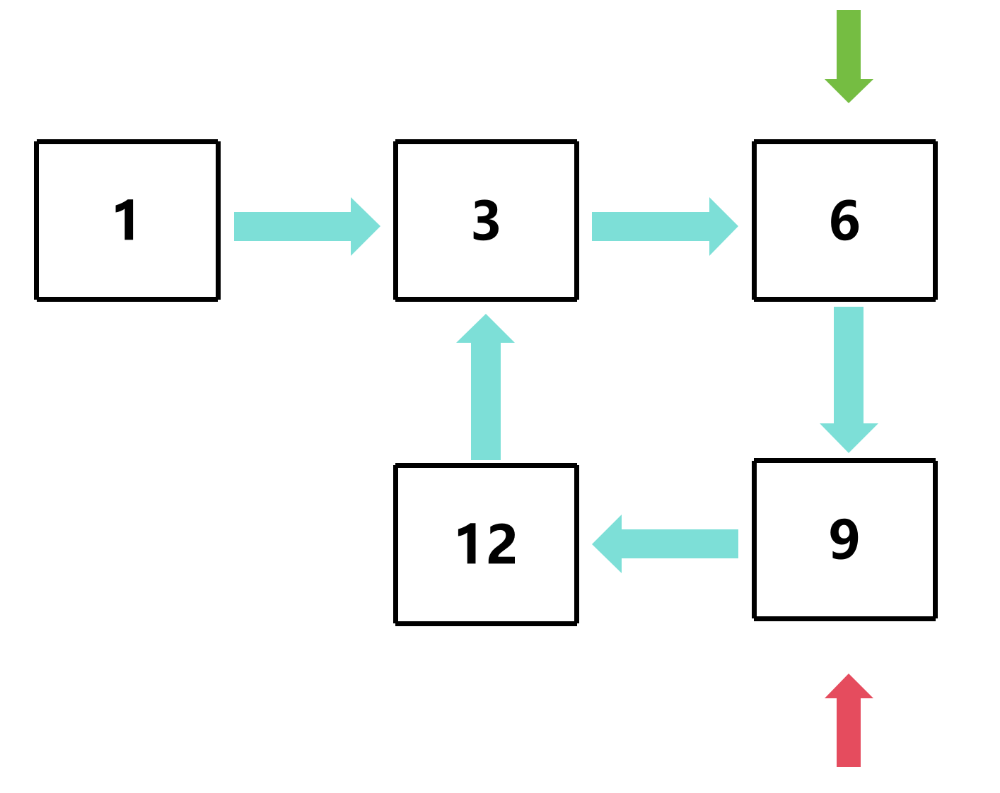
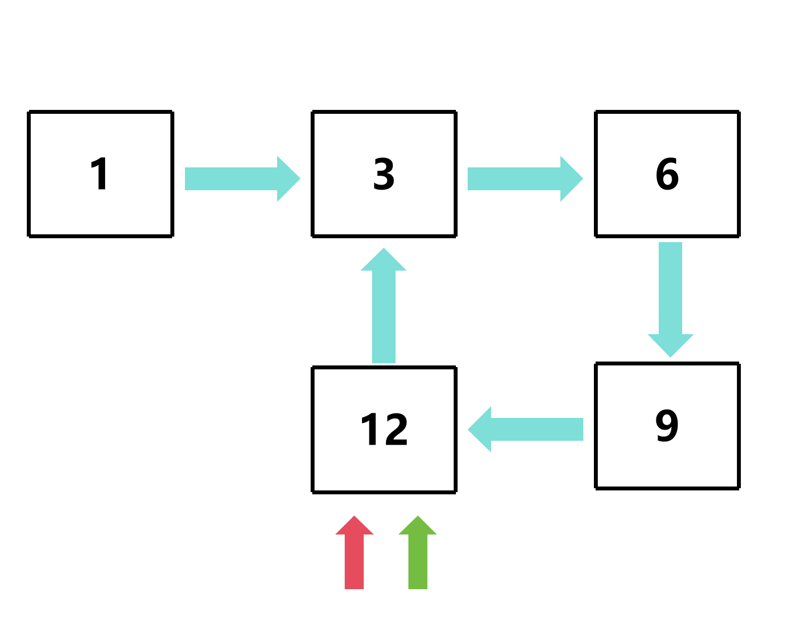

# 检查死循环

## 链表死循环



从图中可以看出，链表的尾节点指向了某个节点，形成了一个环，这就是一个死循环

## 检查步骤

1. 定义一个快指针，每次前进两步
2. 定义一个慢指针，每次前进一步
3. 当快慢指针相遇时，说明链表存在环

**注意：此方法只能确定至少有一个环**

### 图解

**红色为慢指针，绿色为快指针**








## 代码示例

### 创建快慢指针

```c
bool isCycle(Node *root)
{
    Node *slow = root; // 慢指针
    Node *fast = root; // 快指针
}
```

### 遍历链表

#### 移动快慢指针

```c
bool isCycle(Node *root)
{
    Node *slow = root; // 慢指针
    Node *fast = root; // 快指针

    while (  )
    {
        slow = slow->next; // 慢指针前进一步
        fast = fast->next->next; // 快指针前进两步
    }
}
```

#### 确定循环条件

```c
bool isCycle(Node *root)
{
    Node *slow = root; // 慢指针
    Node *fast = root; // 快指针

    while (slow != NULL && fast != NULL)
    {
        slow = slow->next; // 慢指针前进一步
        fast = fast->next->next; // 快指针前进两步
    }
}
```

#### 这里出现的问题

如果链表中没有环，那么快指针会先遍历完链表，`fast->next` 会出现空指针异常

#### 解决方案——增加判断条件

```c
bool isCycle(Node *root)
{
    Node *slow = root; // 慢指针
    Node *fast = root; // 快指针

    while (slow != NULL && fast != NULL && fast->next != NULL)
    {
        slow = slow->next; // 慢指针前进一步
        fast = fast->next->next; // 快指针前进两步
    }
}
```

### 判断是否存在环

```c
bool isCycle(Node *root)
{
    Node *slow = root; // 慢指针
    Node *fast = root; // 快指针

    while (slow != NULL && fast != NULL && fast->next != NULL)
    {
        slow = slow->next; // 慢指针前进一步
        fast = fast->next->next; // 快指针前进两步

        if (slow == fast)
        {
            return true;
        }
    }

    return false;
}
```

[源代码](检查死循环.c#L10)