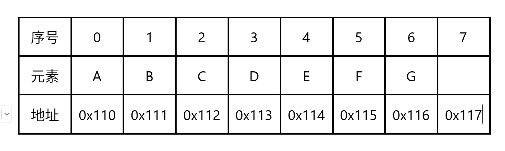
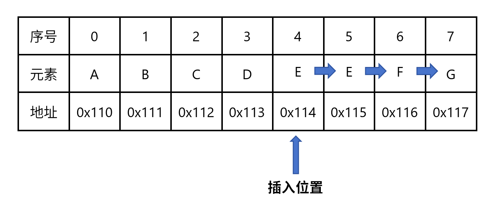
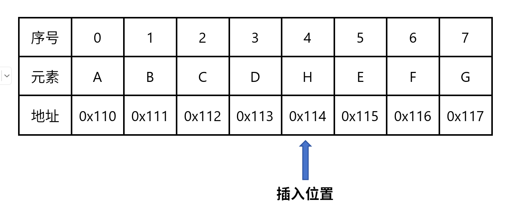
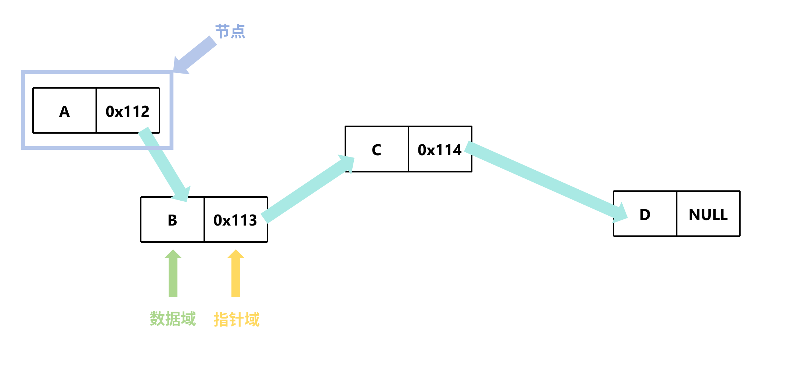
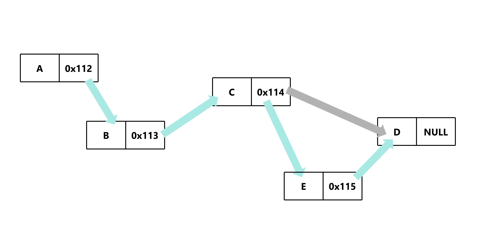
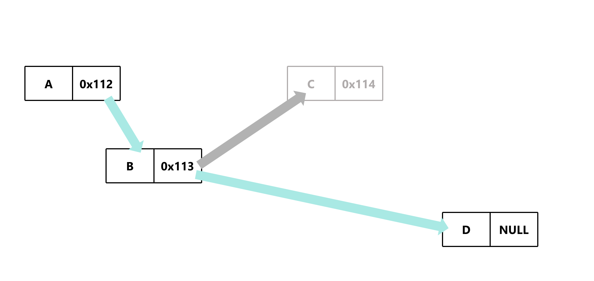
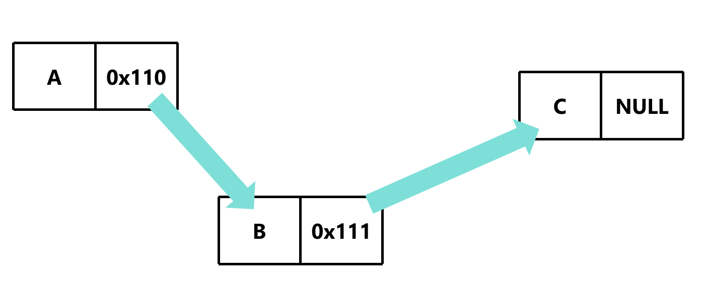
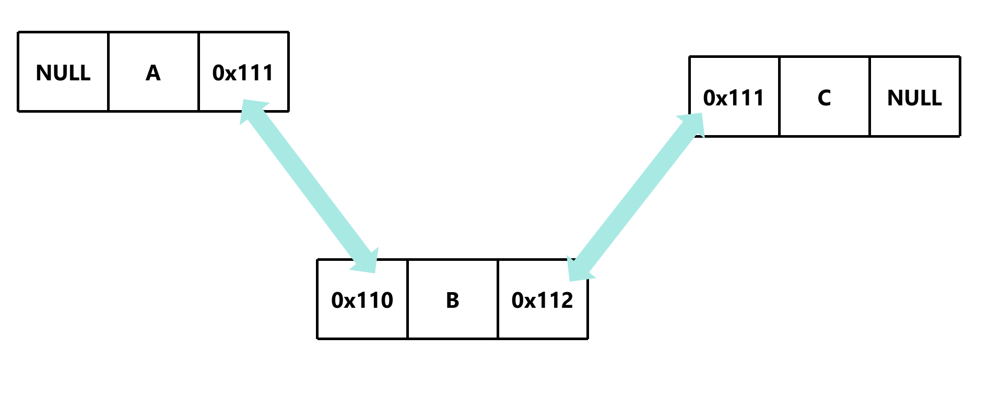

# 链表简介

### 咱们先看一下数组

```c
char array[8] = {'a', 'b', 'c', 'd', 'e', 'f', 'g'};
```
**示意图**


因为数组里面的数据是连续的，所以数组的随机访问非常快

### 但是当我们尝试往数组插入数据时

#### 第一步

#### 第二步


**代码示例**
```c
char array[8] = {'a', 'b', 'c', 'd', 'e', 'f', 'g'};
// 插入一个数据
for (int i = 6; i > 2; i--)
{
    array[i] = array[i-1];
}
array[2] = 'h';
```

当我们尝试往数组插入新数据时，就会变得非常麻烦，因为要先把后面的数据往后移动，然后再插入新数据。如果数组的长度非常大，那么移动的次数就会非常多，这就会导致数组的插入非常慢。**删除也是一样的道理**。

## 解决插入或删除慢的方案——链表
### 特点
1. 链表中的元素叫节点，每个节点包含数据域和指针域
2. 链表中的数据是不连续的，每个数据都有一个指针指向下一个数据的地址

**示意图**



### 插入数据

1. 先创建一个新节点
2. 上一个节点的指针域存储新节点的地址
3. 新节点的指针域存储下一个节点的地址

**示意图**



### 删除数据

1. 上一个节点的指针域存储下一个节点的地址

**示意图**


### 链表类型

**单向链表**


**双向链表**


### 链表的优缺点

#### 优点
1. 插入和删除非常快
2. 链表的长度可以动态变化

#### 缺点
1. 随机访问非常慢
2. 需要更多的内存

### 链表的应用
1. 操作系统中的文件系统
2. 数据库中的索引
3. 导航系统
